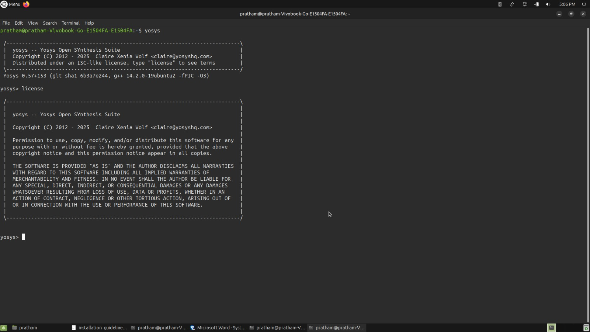
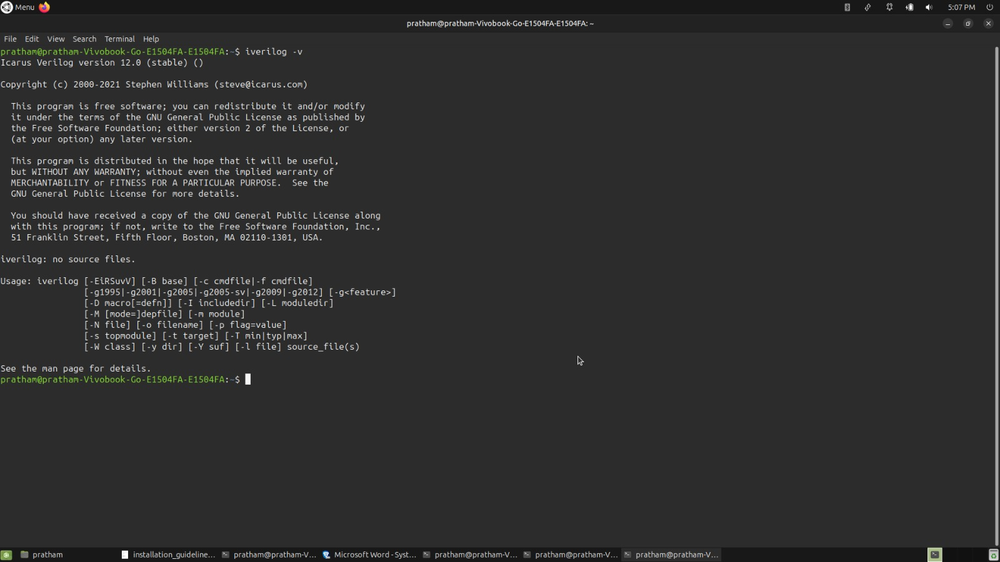
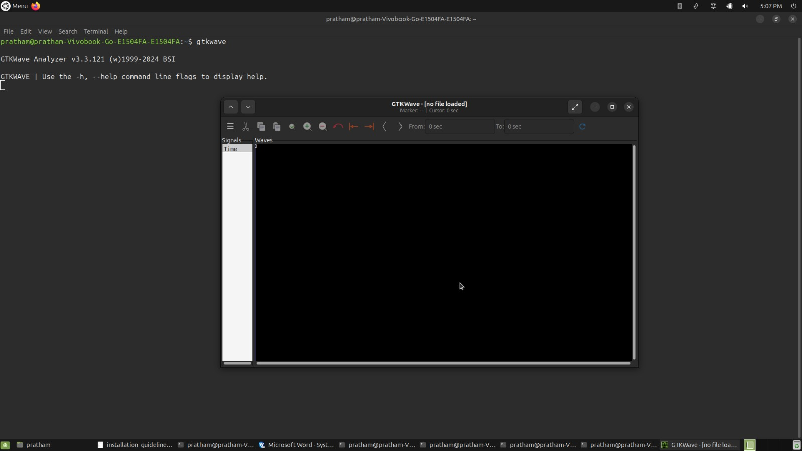
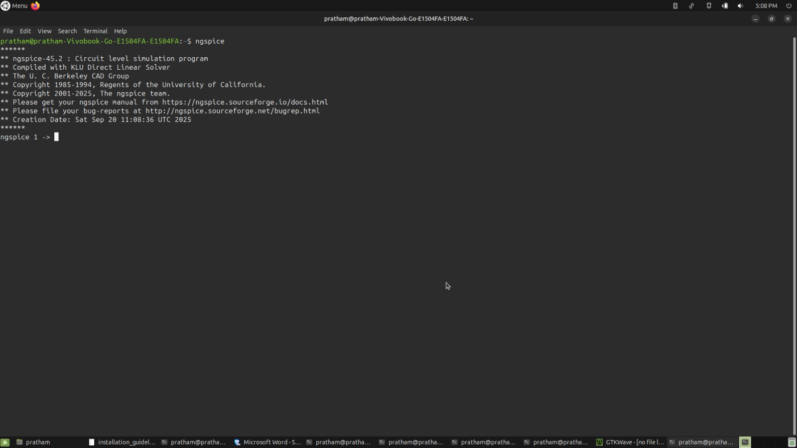
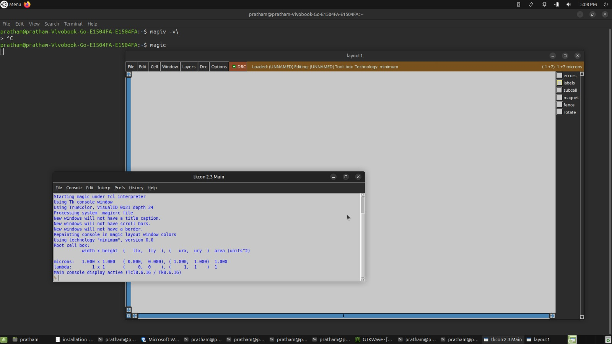
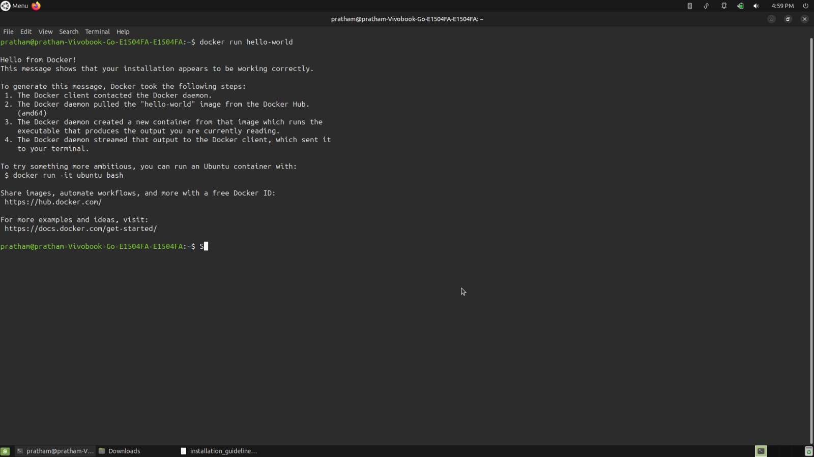

# 🚀 Week 0 – Tools Installation

## 📌 Overview
Week 0 is all about preparing the environment for the SoC Labs journey and Getting Started with Digital VLSI SoC Design and Planning.  
The focus is on setting up open-source EDA tools that will be used throughout the program for **design, simulation, synthesis, and layout**.

---
## Task 1: Getting Started with Digital VLSI SoC Design and Planning - Done ✅
- Understood the **basic flow of Digital VLSI SoC design**.  
- Learned about **RTL design, synthesis, and planning stages** before fabrication.  
- Explored how the SoC Labs program is structured to cover each step of the design journey.  
- This sets the foundation for upcoming experiments in **RTL → GDSII implementation**.
  
---

## Task 2:🖥️ Environment Setup - Done ✅
- I am using **VirtualBox with Ubuntu mate 25.04**.  
- Alternatives include:  
  - **WSL (Windows Subsystem for Linux)** → Ubuntu on Windows  
  - **Dedicated Ubuntu OS** → Native installation for better performance  

### 🔧 System Requirements
| Resource | Requirement |
|----------|-------------|
| OS       | Ubuntu 20.04+ |
| CPU      | 4 vCPUs |
| RAM      | 6 GB minimum |
| Storage  | 50 GB HDD |

---

## 🛠️ Tools Installed

| Tool        | Purpose / Why It’s Used | Verification Command | Screenshot |
|-------------|--------------------------|----------------------|-------------|
| **Yosys**   | Open-source framework for **logic synthesis** (RTL → gate-level netlist). | `yosys-> license` | |
| **Icarus Verilog** | A **Verilog simulator** used to test RTL designs and verify functionality. | `iverilog -V` | |
| **GTKWave** | **Waveform viewer** for analyzing simulation results (`.vcd` files). | `gtkwave --version` | |
| **Ngspice** | **Analog and mixed-signal circuit simulation** at SPICE-level. | `ngspice -v` | |
| **Magic**   | **VLSI layout editor** for viewing and editing layouts. | `magic -version` |  |
| **OpenLANE** | Complete **RTL-to-GDSII flow** (synthesis, placement, routing, signoff). | `docker --version` <br> `make test` |  |

---
## ⚙️ Week 0 – Installation Commands
This section contains all installation steps for the tools required in Week 0. 
## System Update
```bash
$sudo apt-get update 
$sudo apt-get upgrade 
```

## 1. Yosys ✅
```bash
sudo apt-get update
git clone https://github.com/YosysHQ/yosys.git
cd yosys
sudo apt install make   # if not already installed
sudo apt-get install build-essential clang bison flex \
    libreadline-dev gawk tcl-dev libffi-dev git \
    graphviz xdot pkg-config python3 libboost-system-dev \
    libboost-python-dev libboost-filesystem-dev zlib1g-dev
make config-gcc
make
sudo make install
```
## Verification


---
## 2. Icarus Verilog ✅
```bash
sudo apt-get install iverilog
```
Verification


---
## 3. GTKWaves ✅
```bash
sudo apt install gtkwave
```
Verification


---
## 4. Ngspice ✅
```bash
Download ngspice tarball from: https://sourceforge.net/projects/ngspice/files/
tar -zxvf ngspice-37.tar.gz  # change as per the version you download
cd ngspice-37
mkdir release
cd release
../configure --with-x --with-readline=yes --disable-debug
make
sudo make install
```
Verification


---
## 5. Magic ✅
```bash
sudo apt-get install m4
sudo apt-get install tcsh
sudo apt-get install csh
sudo apt-get install libx11-dev
sudo apt-get install tcl-dev tk-dev
sudo apt-get install libcairo2-dev
sudo apt-get install mesa-common-dev libglu1-mesa-dev
sudo apt-get install libncurses-dev
git clone https://github.com/RTimothyEdwards/magic
cd magic
./configure
make
sudo make install
```
Verification


---
## OpenSTA ✅
Use the below link for downloding OpenSTA
```bash
https://github.com/The-OpenROAD-Project/OpenSTA
```
---

